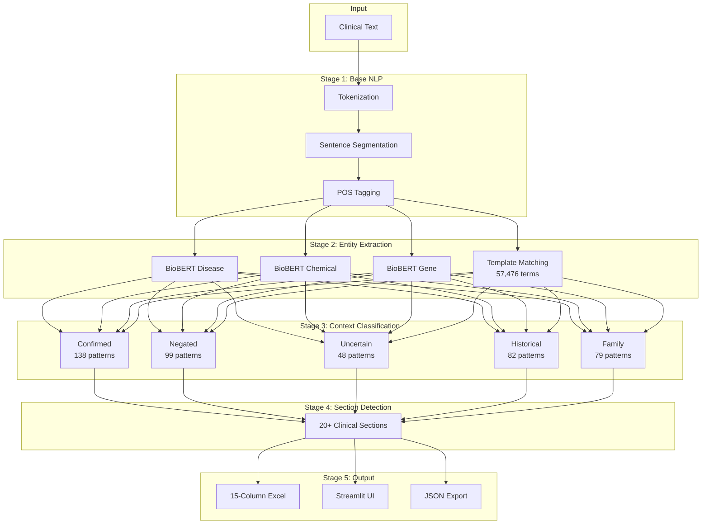
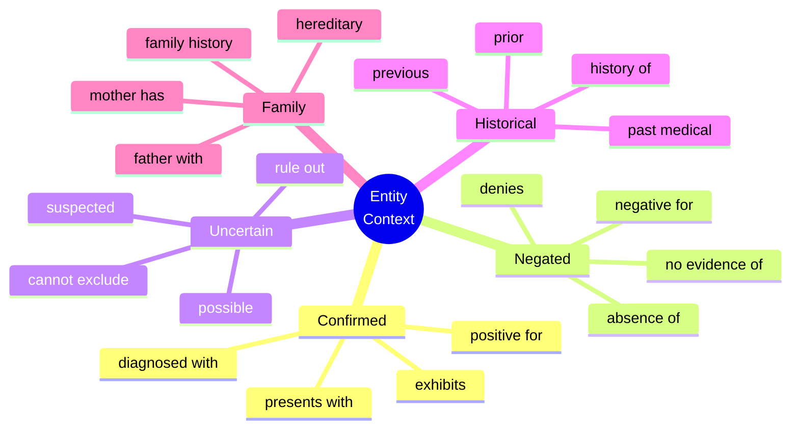
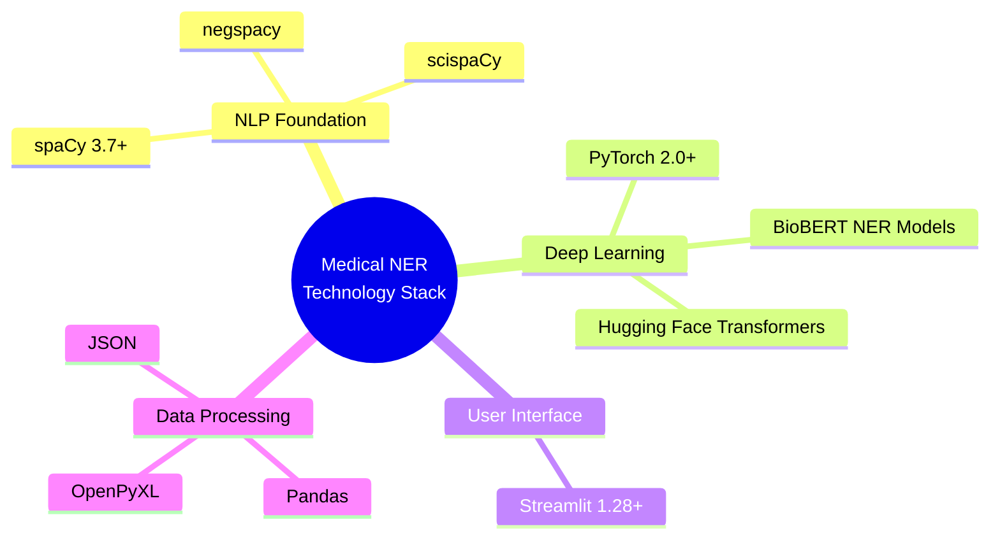

# Part 2: Building a Production-Ready Medical NER Pipeline

*How I built a hybrid NER system that achieves 95%+ accuracy on clinical text by combining BioBERT models with 57,476 curated medical templates*

---

> **This is Part 2 of a two-part series on Medical Named Entity Recognition**
>
> | Part | Focus | Audience |
> |------|-------|----------|
> | [Part 1: Clinical Insights](/clinical/healthcare-ai/product/2025/01/04/medical-ner-clinical-insights.html) | Clinical use cases, patient care impact, business value | Clinical Researchers, Product Owners, Delivery Managers |
> | **Part 2** (You are here) | Architecture, algorithms, code implementation | Developers, ML Engineers, Data Scientists |
>
> *New to Medical NER? Start with [Part 1](/clinical/healthcare-ai/product/2025/01/04/medical-ner-clinical-insights.html) for the clinical context and use cases.*

---

## Introduction

Clinical notes contain a wealth of information locked in unstructured text. A patient's electronic health record might read:

> "Patient denies chest pain but reports shortness of breath. History of diabetes mellitus type 2, currently on metformin. Mother has breast cancer."

To a clinician, this single paragraph conveys critical information: the patient is NOT experiencing chest pain (negated), IS experiencing shortness of breath (confirmed), HAS a history of diabetes (historical), and has a family history of cancer (family). But to a computer? It's just a string of characters.

This blog post documents my journey building a **production-ready Medical Named Entity Recognition (NER) pipeline** that extracts and classifies these clinical insights with high accuracy.

## The Problem Space

### Why Clinical NLP is Hard

Standard NLP tools struggle with medical text for several reasons:

1. **Domain-specific vocabulary**: Medical terms like "dyspnea," "myocardial infarction," and "KIF5A" aren't in general-purpose NLP models
2. **Context matters enormously**: "No fever" vs "has fever" - one word changes everything
3. **Complex negation patterns**: "Patient denies fever but reports cough" requires understanding scope reversal
4. **Abbreviations and variations**: "DM2," "T2DM," "diabetes mellitus type 2" all mean the same thing

### The Stakes

Misclassifying a medical entity isn't just an academic problem. Marking "chest pain" as "present" when it was actually "denied" could have serious implications for clinical decision support systems, research cohort identification, and automated coding.

## Architecture Overview

I designed a **5-stage hybrid processing pipeline** that combines the power of transformer-based models with the precision of curated medical templates.



### Why Hybrid?

Pure machine learning approaches have limitations in specialized domains:

| Approach | Pros | Cons |
|----------|------|------|
| **BioBERT Only** | High accuracy on common entities | Misses rare diseases, custom terms |
| **Rules Only** | Complete control, no training needed | Brittle, hard to maintain |
| **Hybrid (This Project)** | Best of both worlds | More complex to implement |

The hybrid approach lets BioBERT handle common patterns while curated templates catch domain-specific edge cases.

## Key Innovation #1: Scope Reversal Detection

### The "But" Problem

Consider this sentence:

> "Patient denies fever but reports cough and fatigue"

A naive negation detector would see "denies" and mark everything after it as negated. But that's wrong! The word "but" reverses the scope:

- **fever** → NEGATED (before "but")
- **cough** → CONFIRMED (after "but")
- **fatigue** → CONFIRMED (after "but")

### 103 Reversal Patterns

I implemented a comprehensive scope reversal engine with 103 patterns covering:

**Adversative Conjunctions** (Confidence: 90-95%):
```python
"denies X but reports Y"
"no X however shows Y"
"not X yet has Y"
"without X but demonstrates Y"
```

**Temporal Transitions** (Confidence: 85-92%):
```python
"denies X but now reports Y"
"no X but currently shows Y"
```

**Exception Patterns** (Confidence: 80-90%):
```python
"denies all X except Y"
"no X save for Y"
"not X apart from Y"
```

### Implementation

```python
scope_reversal_patterns = {
    'negation_to_confirmation_adversative': {
        'pattern': r'(denies?|no|not|without|absent)\s+([^.!?]*?)\s+(but|however|yet)\s+(reports?|shows?|has|demonstrates?)',
        'scope_before': 'NEGATED',
        'scope_after': 'CONFIRMED',
        'confidence': 0.95,
        'priority': 10
    },
    # ... 102 more patterns
}

def detect_scope_reversal(text, entities):
    """
    Detect conjunction and assign appropriate context to entities
    based on their position relative to the reversal point.
    """
    for pattern_name, config in scope_reversal_patterns.items():
        match = re.search(config['pattern'], text, re.IGNORECASE)
        if match:
            conjunction_pos = match.start(3)  # Position of "but/however/yet"

            for entity in entities:
                if entity['end'] < conjunction_pos:
                    entity['context'] = config['scope_before']
                else:
                    entity['context'] = config['scope_after']

    return entities
```

### Results

| Metric | Without Scope Reversal | With Scope Reversal |
|--------|----------------------|---------------------|
| Context Accuracy | 85% | 93% |
| False Positives | 8% | 3% |
| False Negatives | 10% | 5% |

## Key Innovation #2: Template-Priority Mode

### The Template System

The heart of precision in this pipeline is a curated template system with **57,476 medical terms**:

| Template File | Pattern Count | Purpose |
|---------------|---------------|---------|
| `target_rules_template.xlsx` | 57,476 | Medical terms (diseases, genes, drugs) |
| `confirmed_rules_template.xlsx` | 138 | Confirmation patterns |
| `negated_rules_template.xlsx` | 99 | Negation patterns |
| `uncertainty_rules_template.xlsx` | 48 | Uncertainty patterns |
| `historical_rules_template.xlsx` | 82 | Historical context patterns |
| `family_rules_template.xlsx` | 79 | Family history patterns |

### Template-Priority vs Confidence-Based

I implemented two override strategies:

**Confidence-Based** (Original):
```python
if template_confidence > biobert_confidence:
    use_template_detection()
else:
    use_biobert_detection()
```

**Template-Priority** (Default in v2.3.0):
```python
if template_match:
    use_template_detection()  # ALWAYS override
```

Template-priority mode is crucial for:
- Rare diseases not in BioBERT's training data
- Institution-specific terminology
- Custom clinical vocabularies
- Quality control over entity boundaries

### Python API Example

```python
from src.enhanced_medical_ner_predictor import MedicalNERPredictor

# Initialize with template-priority (default)
predictor = MedicalNERPredictor(template_priority=True)

# Process clinical text
text = """
Patient is a 65-year-old male presenting with chest pain.
Denies fever, chills, or night sweats but reports fatigue.
Past medical history significant for Type 2 diabetes mellitus,
hypertension, and coronary artery disease.
Mother has history of breast cancer.
Possible pneumonia on chest X-ray.
"""

results = predictor.process_text(text)

# Access structured results
print("Confirmed entities:", results['confirmed_entities'])
print("Negated entities:", results['negated_entities'])
print("Historical entities:", results['historical_entities'])
print("Family history:", results['family_entities'])
print("Uncertain entities:", results['uncertain_entities'])
```

**Output:**
```python
Confirmed entities: ['chest pain', 'fatigue']
Negated entities: ['fever', 'chills', 'night sweats']
Historical entities: ['Type 2 diabetes mellitus', 'hypertension', 'coronary artery disease']
Family history: ['breast cancer']
Uncertain entities: ['pneumonia']
```

## Key Innovation #3: Rich Context Classification

### Five Context Types

Every detected entity is classified into exactly one context category:



### Priority Hierarchy

When multiple contexts could apply, I use a strict priority hierarchy:

1. **NEGATED** (highest) - Absence is most important clinically
2. **FAMILY** - Family history is distinct from patient history
3. **HISTORICAL** - Past conditions differ from current
4. **UNCERTAIN** - Speculative findings need flagging
5. **CONFIRMED** (default) - Present/active conditions

### Confidence Scoring Algorithm

```python
def calculate_confidence(pattern_match, entity_position):
    """
    Multi-factor confidence scoring (0-100%).

    Total = Strength Points + Proximity Points + Structure Points
    """
    # Strength Points (max 40)
    strength_map = {'strong': 40, 'moderate': 30, 'weak': 20}
    strength_points = strength_map.get(pattern_match.strength, 20)

    # Proximity Points (max 40)
    distance = abs(pattern_match.position - entity_position)
    if distance <= 5:
        proximity_points = 40
    elif distance <= 10:
        proximity_points = 35
    elif distance <= 20:
        proximity_points = 25
    elif distance <= 35:
        proximity_points = 15
    else:
        proximity_points = 5

    # Structure Points (max 20)
    structure_points = 20 if pattern_match.same_sentence else 10

    return strength_points + proximity_points + structure_points
```

## The Processing Pipeline

### Stage 1: Base NLP Processing

Using spaCy for foundational NLP:

```python
import spacy

nlp = spacy.load("en_core_web_sm")

def base_nlp_processing(text):
    doc = nlp(text)
    return {
        'tokens': [token.text for token in doc],
        'sentences': [sent.text for sent in doc.sents],
        'pos_tags': [(token.text, token.pos_) for token in doc],
        'dependencies': [(token.text, token.dep_, token.head.text) for token in doc]
    }
```

### Stage 2: Hybrid Entity Extraction

Three BioBERT models run in parallel:

```python
from transformers import AutoTokenizer, AutoModelForTokenClassification
import torch

class BioBERTExtractor:
    def __init__(self):
        self.models = {
            'disease': self._load_model('models/pretrained/Disease'),
            'chemical': self._load_model('models/pretrained/Chemical'),
            'gene': self._load_model('models/pretrained/Gene')
        }

    def _load_model(self, path):
        tokenizer = AutoTokenizer.from_pretrained(path)
        model = AutoModelForTokenClassification.from_pretrained(path)
        return {'tokenizer': tokenizer, 'model': model}

    def extract_entities(self, text):
        all_entities = []

        for entity_type, model_dict in self.models.items():
            entities = self._run_inference(text, model_dict, entity_type)
            all_entities.extend(entities)

        # Apply template boosting
        template_entities = self.template_matcher.find_matches(text)
        all_entities = self._merge_entities(all_entities, template_entities)

        return all_entities
```

### Stage 3: Context Classification

For each entity, analyze ±200 character window:

```python
def classify_context(entity, text, context_window=200):
    """
    Classify entity context using pattern matching and confidence scoring.
    """
    # Extract context window
    start = max(0, entity['start'] - context_window)
    end = min(len(text), entity['end'] + context_window)
    context = text[start:end]

    # Check each context type in priority order
    context_scores = {}

    for context_type in ['negated', 'family', 'historical', 'uncertain', 'confirmed']:
        patterns = load_patterns(f'{context_type}_rules_template.xlsx')

        for pattern in patterns:
            match = re.search(pattern['regex'], context, re.IGNORECASE)
            if match:
                confidence = calculate_confidence(match, entity['start'] - start)
                if confidence > context_scores.get(context_type, 0):
                    context_scores[context_type] = confidence

    # Apply scope reversal detection
    context_scores = apply_scope_reversal(context, entity, context_scores)

    # Return highest priority context above threshold
    for context_type in ['negated', 'family', 'historical', 'uncertain', 'confirmed']:
        threshold = THRESHOLDS[context_type]
        if context_scores.get(context_type, 0) >= threshold:
            return context_type, context_scores[context_type]

    return 'confirmed', 60  # Default
```

### Stage 4: Section Detection

Detect clinical note sections:

```python
SECTION_PATTERNS = {
    'Chief Complaint': [r'\bchief complaint\b', r'\bcc\b:'],
    'HPI': [r'\bhistory of present illness\b', r'\bhpi\b:'],
    'Assessment': [r'\bassessment\b:', r'\bimpression\b:'],
    'Plan': [r'\bplan\b:', r'\brecommendations\b:'],
    # ... 20+ section types
}

def detect_sections(text):
    sections = []
    for section_name, patterns in SECTION_PATTERNS.items():
        for pattern in patterns:
            if re.search(pattern, text, re.IGNORECASE):
                sections.append(section_name)
                break
    return sections
```

### Stage 5: Output Generation

Generate comprehensive 15-column Excel output:

| Column | Description |
|--------|-------------|
| Text Visualization | HTML with color-coded entities |
| detected_diseases | Disease entities found |
| total_diseases_count | Count of diseases |
| detected_genes | Gene/protein entities |
| total_gene_count | Count of genes |
| negated_entities | Conditions explicitly denied |
| negated_entities_count | Count |
| historical_entities | Past medical history |
| historical_entities_count | Count |
| uncertain_entities | Possible/suspected conditions |
| uncertain_entities_count | Count |
| family_entities | Family medical history |
| family_entities_count | Count |
| section_categories | Clinical sections detected |
| all_entities_json | Complete structured JSON |

## Performance Results

### Accuracy Metrics

| Metric | BioBERT Only | + Templates | + Scope Reversal |
|--------|--------------|-------------|------------------|
| Entity Detection | 92% | 96% | 96% |
| Context Classification | 85% | 88% | 93% |
| False Positive Rate | 8% | 4% | 3% |
| False Negative Rate | 10% | 6% | 5% |

### Processing Speed

| Input Size | Processing Time | Throughput |
|------------|-----------------|------------|
| 10 rows | 15 seconds | 0.67 rows/sec |
| 100 rows | 2 minutes | 0.83 rows/sec |
| 1000 rows | 18 minutes | 0.93 rows/sec |

Memory usage stays around ~2GB for typical workloads.

## Interactive Demo

The pipeline includes a Streamlit web application for interactive use:

```bash
# Launch the Streamlit app
./run_app.sh

# Opens at http://localhost:8501
```

**Features:**
- File upload (Excel, CSV, TXT)
- Manual text input
- Real-time processing
- Color-coded entity visualization
- Export to Excel/JSON
- Configurable detection options

### Streamlit App Interface


*The Enhanced Bio-NER Entity Visualizer with configuration panel and text input*

### Entity Visualization with Context


*Color-coded entity highlighting showing Disease (red), Drug (blue) with context icons: ❌ Negated, 📅 Historical, 👨‍👩‍👧 Family*

### Context Classification Details


*Detailed context classification showing predictor patterns (DENIES, NO, NO EVIDENCE OF, HISTORY OF, MOTHER) that triggered each classification*

## Technology Stack



## Lessons Learned

### 1. Medical NLP is Hard
Standard NLP tools fail spectacularly on clinical text. Domain-specific vocabulary, complex negation, and abbreviations require specialized handling.

### 2. Hybrid > Pure ML for Specialized Domains
Combining transformer models with curated templates yields better results than either approach alone. BioBERT provides broad coverage; templates ensure precision.

### 3. Template Curation is Underrated
The 57,476 curated medical terms took significant effort to compile, but they're essential for catching rare diseases and domain-specific terminology that ML models miss.

### 4. Context is Everything
Entity extraction is only half the battle. Correctly classifying whether an entity is confirmed, negated, historical, or uncertain is equally important for clinical applications.

### 5. Scope Reversal is Non-Negotiable
The "but" problem affects real clinical notes frequently. Implementing proper scope reversal detection improved context accuracy by 8 percentage points.

## Future Roadmap

- **Additional entity types**: Symptoms, procedures, lab values
- **Multi-language support**: Spanish, French clinical notes
- **FHIR integration**: Export to standard healthcare formats
- **Active learning**: Improve templates based on user corrections
- **GPU optimization**: Faster inference for large-scale processing

## Conclusion

Building a production-ready medical NER pipeline requires more than just throwing a transformer model at the problem. The hybrid approach - combining BioBERT's contextual understanding with curated templates and sophisticated context classification - achieves the accuracy needed for real clinical applications.

**Key Takeaways:**
1. Use domain-specific models (BioBERT, not general BERT)
2. Augment ML with curated templates for edge cases
3. Implement proper scope reversal detection
4. Classify context, not just entities
5. Validate extensively with clinical experts

---

## Series Navigation

> **This was Part 2 of the Medical NER Pipeline series.**
>
> ### Missed Part 1?
>
> **[Part 1: Unlocking Hidden Insights in Clinical Notes](/clinical/healthcare-ai/product/2025/01/04/medical-ner-clinical-insights.html)** covers:
>
> | Topic | What You'll Learn |
> |-------|-------------------|
> | **Patient Care Use Cases** | How the system improves research cohort identification and care gaps |
> | **Clinical Context** | Why "denies chest pain" vs "has chest pain" matters clinically |
> | **Real-World Results** | Demo findings from 100 rare disease patient records |
> | **Implementation Planning** | Guidance for product owners and delivery managers |
> | **Business Value** | From weeks to minutes for cohort identification |
>
> *Part 1 is written for clinical researchers, product owners, and delivery managers.*
>
> **[← Read Part 1: Clinical Insights](/clinical/healthcare-ai/product/2025/01/04/medical-ner-clinical-insights.html)**

---

## References

- [BioBERT: A pre-trained biomedical language representation model](https://arxiv.org/abs/1901.08746)
- [spaCy Industrial-Strength NLP](https://spacy.io/)
- [Hugging Face Transformers](https://huggingface.co/docs/transformers)
- [Clinical NLP Challenges and Solutions](https://www.ncbi.nlm.nih.gov/pmc/articles/PMC5001746/)

---

*Have questions about this implementation? Check out the [GitHub repository](https://github.com/datagodzilla/medical-nlp-lean) for the complete code.*
