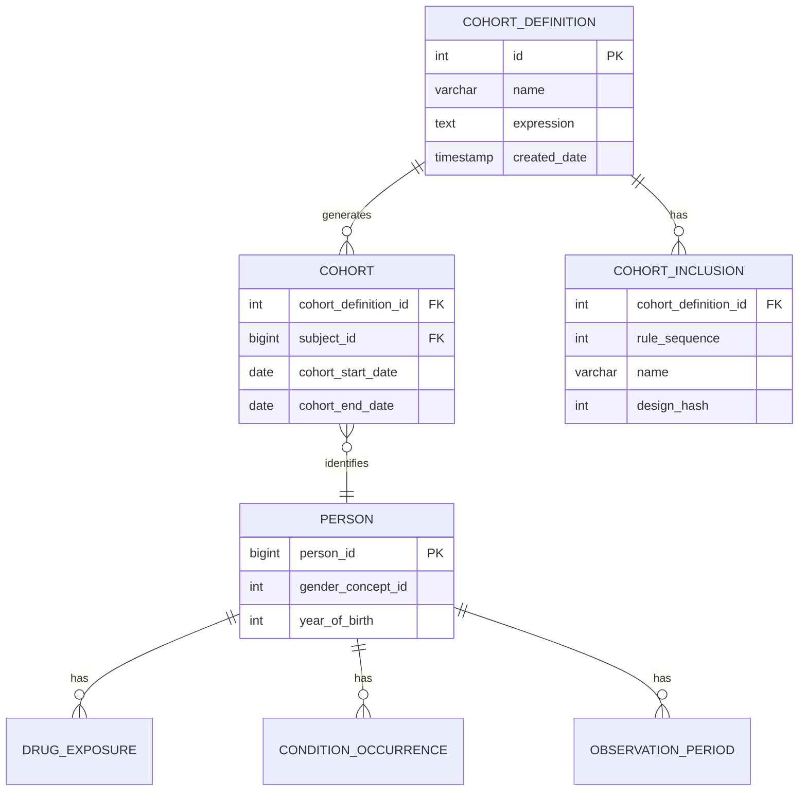

# Mastering ATLAS Cohort Definitions: A Clinical Researcher's Complete Guide

## The Journey So Far

Building on our exploration of the OMOP Common Data Model, standardized vocabularies like SNOMED CT, RxNorm, and LOINC, ETL fundamentals, and data quality assessment with Achilles, we've reached a pivotal milestone: **defining patient cohorts in OHDSI ATLAS**.

Everything we've built so far—the PostgreSQL databases, the vocabulary mappings, the synthetic patient data from Synthea, the data quality reports—exists for one purpose: to answer clinical questions about real-world patient populations. And in observational health research, every question begins with a cohort.

As the *Book of OHDSI* puts it:

> **"A cohort is not just a list of patients—it's the operationalization of a clinical question."**

This post documents our experience connecting ATLAS to our own database, building a Type 2 Diabetes cohort from scratch, understanding what happens in the backend tables, and navigating the WebAPI schema compatibility challenges we encountered along the way.

---

## Why ATLAS and OHDSI Matter: Global Impact at Scale

Before diving into cohort building, let's understand why OHDSI's tooling has become essential for healthcare research worldwide.

### The OHDSI Network by the Numbers

OHDSI (Observational Health Data Sciences and Informatics) has grown into one of the largest international collaboratives in healthcare data science:

| Metric | Scale |
|--------|-------|
| **Collaborators** | 4,200+ across 83 countries |
| **Patient Records** | ~810 million (~12% of world population) |
| **Data Partners** | 453+ organizations (EHRs, claims, registries) |
| **ATLAS GitHub** | 294 stars, 50+ contributors |
| **EHDEN Network** | 100+ data partners across Europe |
| **Publications** | 150+ peer-reviewed papers |

Major regulatory bodies including the **FDA** (United States), **EMA** via **DARWIN EU** (European Union), and **Korea HIRA** use OHDSI tools for drug safety surveillance and real-world evidence studies. The **EHDEN** project alone has standardized 500+ million European patient records to the OMOP CDM format.

### What is ATLAS?

ATLAS is the flagship web application of the OHDSI ecosystem. It provides a graphical interface for:

- **Vocabulary exploration** - Search millions of standardized medical concepts
- **Cohort definition** - Define patient populations using clinical criteria
- **Characterization** - Compare baseline characteristics across cohorts
- **Population-level estimation** - Causal inference studies
- **Patient-level prediction** - Machine learning models for outcomes
- **Pathway analysis** - Treatment sequences and care patterns


*The ATLAS home screen provides navigation to all OHDSI analytical tools*

When researchers say they're "using OHDSI," they typically mean they're using ATLAS to design studies that can be executed across the global network of OMOP-standardized databases.

---

## Why Cohorts Are the Foundation of Clinical Research

### What is a Cohort?

In clinical research, a **cohort** is a defined group of patients who share specific characteristics. Unlike ad-hoc database queries, cohorts are:

1. **Reproducible** - The same definition produces the same patients every time
2. **Shareable** - Definitions can be exchanged between institutions
3. **Standardized** - Built on common data models and vocabularies
4. **Versioned** - Changes are tracked over time
5. **Portable** - Write once, run anywhere across 450+ OMOP databases

Everything in observational research starts with the question: **"Which patients?"** The validity of any study depends on precisely defining the population. A poorly specified cohort undermines all downstream analyses, no matter how sophisticated the statistical methods.

### The Clinical Question Behind Every Cohort

Consider this scenario:

> **Dr. Sarah Chen**, an endocrinologist at a large academic medical center, wants to study cardiovascular outcomes in Type 2 Diabetes patients initiating metformin therapy. She needs to identify patients who:
>
> - Have a confirmed T2DM diagnosis
> - Are starting metformin for the first time
> - Have sufficient medical history to assess baseline characteristics
> - Don't have Type 1 diabetes or gestational diabetes (different populations)

Without standardized cohort definitions, every institution would interpret "Type 2 Diabetes patients on metformin" differently. Some might include anyone who ever took metformin. Others might miss patients coded with specific T2DM subtypes. ATLAS solves this by providing a visual cohort builder that generates portable JSON definitions.

### Mapping Clinical Criteria to OMOP Concepts

Dr. Chen's clinical requirements translate to specific OMOP vocabulary concepts:

| Clinical Criterion | OMOP Domain | Vocabulary | Concept ID | Concept Name |
|-------------------|-------------|------------|------------|--------------|
| T2DM Diagnosis | Condition | SNOMED CT | 201826 | Type 2 diabetes mellitus |
| Metformin | Drug | RxNorm | 6809 | metformin |
| T1DM (exclude) | Condition | SNOMED CT | 201254 | Type 1 diabetes mellitus |
| Gestational DM (exclude) | Condition | SNOMED CT | 4024659 | Gestational diabetes mellitus |

This mapping table is the bridge between clinical thinking and database queries. Every cohort starts here.

---

## Our Database Setup

### What We Had Built

After extensive preparation across previous work, our PostgreSQL database contained:

```
Database: ohdsi_learning
├── cdm (OMOP CDM 5.4)
│   ├── person (2,411 synthetic patients)
│   ├── condition_occurrence (diagnoses)
│   ├── drug_exposure (medications)
│   ├── procedure_occurrence (procedures)
│   ├── measurement (lab results, vitals)
│   └── observation (other clinical findings)
├── vocabulary (OMOP Standardized Vocabularies)
│   ├── concept (~6 million concepts)
│   ├── concept_relationship (hierarchies)
│   └── concept_ancestor (ancestry)
├── results (Analysis outputs)
│   ├── achilles_results (data characterization)
│   └── cohort (generated patient lists)
└── webapi (ATLAS configuration)
    ├── source (data source registration)
    └── source_daimon (schema mappings)
```

We deployed OHDSI Broadsea using Docker Compose, configured our external database as a data source, and launched ATLAS.

### First Success: Data Sources Dashboard

The Data Sources dashboard confirmed our setup was working. ATLAS correctly displayed our 2,411 synthetic patients with demographic breakdowns:


*The CDM Summary shows 2,411 patients with gender distribution from our Synthea data*

This visualization is powered by **Achilles**, OHDSI's data characterization package. When you click "Data Sources" in ATLAS, you're seeing pre-computed statistics stored in the `achilles_results` table.

---

## Building the Type 2 Diabetes Cohort: Step by Step

Let's walk through creating Dr. Chen's cohort for Type 2 Diabetes Mellitus—one of the most common chronic conditions affecting over 400 million people worldwide.

### Step 1: Vocabulary Search

Every cohort starts with finding the right clinical concepts. In ATLAS, navigate to **Search** and enter "type 2 diabetes":


*Searching for "type 2 diabetes" returns 299 concepts across multiple vocabularies*

The search returns concepts from multiple standardized vocabularies:
- **SNOMED CT** - The primary clinical terminology (concept 201826 for T2DM)
- **ICD-10-CM** - Billing/administrative codes (E11.x family)
- **Read** - UK primary care codes
- **MedDRA** - Adverse event terminology

Notice the "RC" (Record Count) and "DRC" (Descendant Record Count) columns—these show how many records in your database match each concept.

### Step 2: Understanding the Concept Hierarchy

SNOMED concept **201826** ("Type 2 diabetes mellitus") is a clinical finding in the Condition domain. When you build a cohort using this concept, ATLAS can automatically include all **descendant concepts**—more specific subtypes like:

- Type 2 diabetes mellitus with diabetic nephropathy
- Type 2 diabetes mellitus with peripheral neuropathy
- Type 2 diabetes mellitus with retinopathy
- Type 2 diabetes mellitus without complication

This hierarchical inclusion is crucial for capturing all relevant patients. Without descendants, you might miss patients whose diagnosis was coded more specifically.

### Step 3: Building the Cohort Definition

Navigate to **Cohort Definitions** → **New Cohort Definition**. Here's what a Type 2 Diabetes cohort looks like in ATLAS:


*The cohort builder showing entry events, inclusion criteria, and exit settings*

The definition has four key sections:

#### Cohort Entry Events
```
a condition occurrence of [Type 2 Diabetes Mellitus]
for the first time in the person's history
with continuous observation of at least 365 days before
```

This ensures we're capturing **incident** (new) cases, not prevalent cases. The 365-day lookback confirms patients were observable before their first diagnosis—essential for establishing baseline characteristics.

#### Inclusion Criteria
```
1. Age at least 18 at index
2. No prior diagnosis of Type 1 diabetes mellitus
3. No prior diagnosis of gestational diabetes
```

These rules refine the population. Each criterion is evaluated against the initial event population, and ATLAS tracks how many patients pass each rule.

#### Cohort Exit
```
Event will persist until: fixed duration relative to initial event
Event date to offset from: end date
Number of days offset: 0
```

This determines how long each patient "stays" in the cohort. Different research questions require different exit strategies—some studies follow patients until they leave the database, others for fixed time windows.

### Step 4: Generating the Cohort

After saving the definition, navigate to the **Generation** tab and click "Generate" for your data source:


*Generation completed successfully—but notice the "..." in People and Records columns*

Here we encounter our first sign of trouble. The generation status shows **COMPLETE**, but the People and Records columns display "..." instead of actual counts.

---

## What's Really Happening: The Backend Cohort Tables

To understand ATLAS fully, you need to know what's happening in the database when cohorts are generated.

### The Data Model for Cohorts



### The Cohort Generation Pipeline

```
┌──────────────────────────────────────────────────────────────────┐
│                    Cohort Generation Pipeline                     │
├──────────────────────────────────────────────────────────────────┤
│                                                                   │
│  ┌─────────────────┐    ┌─────────────────┐    ┌──────────────┐ │
│  │ ATLAS UI        │───▶│ WebAPI          │───▶│ PostgreSQL   │ │
│  │ (Browser)       │    │ (Java/Tomcat)   │    │ (Database)   │ │
│  └─────────────────┘    └─────────────────┘    └──────────────┘ │
│          │                      │                      │         │
│          ▼                      ▼                      ▼         │
│  ┌─────────────────┐    ┌─────────────────┐    ┌──────────────┐ │
│  │ JSON Definition │───▶│ CIRCE Compiler  │───▶│ SQL Execution│ │
│  │ {expression}    │    │ (SQL Generator) │    │ INSERT INTO  │ │
│  └─────────────────┘    └─────────────────┘    │ results.cohort│ │
│                                                 └──────────────┘ │
│                                                                   │
└──────────────────────────────────────────────────────────────────┘
```

When you click "Generate" in ATLAS:

1. **ATLAS UI** sends the cohort definition JSON to **WebAPI**
2. **CIRCE** (the cohort SQL compiler) translates JSON to database-specific SQL
3. **SqlRender** adapts the SQL for PostgreSQL syntax
4. The SQL **executes** against your CDM data tables
5. Results are **inserted** into the `results.cohort` table

### Simplified Generated SQL

Here's a simplified version of what CIRCE generates for our T2DM cohort:

```sql
INSERT INTO results.cohort (cohort_definition_id, subject_id, cohort_start_date, cohort_end_date)
SELECT
    @cohort_id AS cohort_definition_id,
    p.person_id AS subject_id,
    co.condition_start_date AS cohort_start_date,
    op.observation_period_end_date AS cohort_end_date
FROM cdm.condition_occurrence co
JOIN cdm.person p ON co.person_id = p.person_id
JOIN cdm.observation_period op ON p.person_id = op.person_id
WHERE co.condition_concept_id IN (
    SELECT descendant_concept_id
    FROM vocabulary.concept_ancestor
    WHERE ancestor_concept_id = 201826  -- T2DM
)
AND co.condition_start_date >= DATE_ADD(op.observation_period_start_date, INTERVAL 365 DAY)
AND YEAR(co.condition_start_date) - p.year_of_birth >= 18
AND NOT EXISTS (
    SELECT 1 FROM cdm.condition_occurrence co2
    WHERE co2.person_id = p.person_id
    AND co2.condition_concept_id IN (
        SELECT descendant_concept_id
        FROM vocabulary.concept_ancestor
        WHERE ancestor_concept_id = 201254  -- T1DM
    )
    AND co2.condition_start_date < co.condition_start_date
);
```

### The Key Backend Tables

#### `results.cohort` - The Patient List
```sql
SELECT cohort_definition_id, subject_id, cohort_start_date, cohort_end_date
FROM results.cohort
WHERE cohort_definition_id = 2;  -- Type 2 Diabetes cohort

-- Result:
-- cohort_definition_id | subject_id | cohort_start_date | cohort_end_date
-- 2                    | 1001       | 2015-03-15        | 2023-06-30
-- 2                    | 1042       | 2018-07-22        | 2023-12-01
-- 2                    | 1156       | 2020-01-10        | 2023-08-15
-- ... (220 rows total)
```

#### `results.cohort_inclusion` - The Rules
```sql
SELECT cohort_definition_id, rule_sequence, name
FROM results.cohort_inclusion
WHERE cohort_definition_id = 2;

-- Result:
-- cohort_definition_id | rule_sequence | name
-- 2                    | 0             | Age at least 18 at index
-- 2                    | 1             | No prior Type 1 diabetes
```

### Direct Database Verification

When ATLAS shows unexpected results, **always check the database directly**:

```sql
-- Count patients in each cohort
SELECT cd.name, COUNT(DISTINCT c.subject_id) AS persons
FROM results.cohort c
JOIN webapi.cohort_definition cd ON c.cohort_definition_id = cd.id
GROUP BY cd.name
ORDER BY persons DESC;

-- Result:
-- name                   | persons
-- Type 2 Diabetes Cohort | 220
-- New Statin Users       | 162
-- Multiple Chronic       | 123
-- Metformin Users        | 76
```

This query confirmed our cohorts were generated correctly—**the data is right, even when the UI shows "..."**

---

## The Schema Compatibility Problem

### What Went Wrong

After successfully generating cohorts, we attempted to run **Cohort Characterization**—a feature that compares baseline demographics, conditions, and medications across cohorts.

That's when the errors started:

```
ERROR: schema "temp" does not exist
ERROR: column "design_hash" of relation "cohort_inclusion" does not exist
ERROR: relation "results.cohort_cache" does not exist
ERROR: relation "results.cohort_censor_stats_cache" does not exist
ERROR: column "mode_id" does not exist
```

### The Root Cause

**WebAPI 2.x has evolved significantly beyond the base OMOP CDM specification.**

The OMOP CDM defines clinical tables (`person`, `condition_occurrence`, etc.) and basic results tables. But WebAPI has added:

| Component | Purpose | OMOP CDM | WebAPI 2.x |
|-----------|---------|----------|------------|
| `temp` schema | Working space for analytics | No | Required |
| `design_hash` column | Cache invalidation | No | Required |
| `*_cache` tables | Performance optimization | No | Required |
| `mode_id` column | Generation mode tracking | No | Required |

These additions are managed by **Flyway database migrations** in WebAPI. When WebAPI starts with its built-in database, these migrations run automatically. But when you connect an external database, **they don't run**.

---

## Common Pitfalls in Cohort Design

Based on our experience and insights from the OHDSI community (particularly the [Phenotype Phebruary](https://forums.ohdsi.org/t/phenotype-phebruary-day-1-type-2-diabetes-mellitus/15764) discussions on the forums), here are the most common mistakes:

| Pitfall | Why It Happens | Solution |
|---------|----------------|----------|
| **Overly specific concept sets** | Using only one concept code, missing subtypes | Include descendants in concept sets |
| **No prior observation requirement** | Assuming all patients have complete history | Require minimum 365 days prior observation |
| **Ignoring drug eras** | Fragmented prescription records | Use persistence windows or drug eras |
| **Including prevalent users** | Not specifying first occurrence | Require "for the first time in history" |
| **Missing exclusion criteria** | Not filtering out related conditions | Add explicit exclusion rules (T1DM, gestational DM) |
| **Wrong exit strategy** | Patients exiting cohort too early or never | Match exit criteria to research question |
| **Not validating with characterization** | Trusting counts without inspection | Always run characterization before analysis |

### Community Insights from OHDSI Forums

The [OHDSI Forums](https://forums.ohdsi.org/) are invaluable for cohort design. Key threads to review:

- **[Phenotype Phebruary: Type 2 Diabetes Mellitus](https://forums.ohdsi.org/t/phenotype-phebruary-day-1-type-2-diabetes-mellitus/15764)** - Community-validated T2DM phenotype with discussion of edge cases
- **Best Practices for Cohort Design** - Consensus recommendations from experienced implementers
- **Troubleshooting WebAPI Issues** - Solutions to common deployment problems

The community has learned that **concept set design is 80% of cohort quality**. Invest time in building comprehensive, validated concept sets before worrying about complex inclusion logic.

---

## Three Paths Forward for External Databases

### Option 1: Manual Schema Patching

Create missing tables and columns reactively as errors appear:

```sql
-- Create temp schema
CREATE SCHEMA IF NOT EXISTS temp;
GRANT ALL ON SCHEMA temp TO PUBLIC;

-- Add missing columns
ALTER TABLE results.cohort_inclusion
  ADD COLUMN IF NOT EXISTS design_hash INT;

-- Create cache tables
CREATE TABLE IF NOT EXISTS results.cohort_cache (...);
```

**Pros:** Works for core features; good for learning
**Cons:** Incomplete; may break with WebAPI updates; tedious

### Option 2: Run WebAPI Flyway Migrations

Apply the official DDL scripts from the WebAPI repository:

```bash
git clone https://github.com/OHDSI/WebAPI.git
cd WebAPI/src/main/resources/db/migration/postgresql
# Apply migrations manually or configure Flyway
```

**Pros:** Complete and version-matched
**Cons:** Complex setup; requires Flyway knowledge

### Option 3: Use Broadsea's Built-in Database (Recommended)

Start Broadsea with its default configuration, then migrate your data into the pre-configured database:

```bash
# Start Broadsea (includes broadsea-atlasdb container)
docker-compose up -d

# Export your CDM data from external database
pg_dump -h localhost -U postgres -d ohdsi_learning \
  --schema=cdm --schema=vocabulary --data-only -f cdm_export.sql

# Import into Broadsea's database
docker exec -i broadsea-atlasdb psql -U postgres < cdm_export.sql
```

**Pros:** Zero schema errors; all features work; easiest maintenance
**Cons:** Requires data migration; additional container

---

## Key Takeaways

Here's what we learned from building cohorts in ATLAS:

- **Cohorts are algorithms, not just patient lists** — They're reproducible across any OMOP CDM database worldwide

- **Three components define every cohort** — Entry event, inclusion criteria, exit criteria

- **ATLAS generates SQL** — Understanding backend tables helps debugging when the UI shows unexpected results

- **Concept sets are building blocks** — Invest time in creating comprehensive, validated concept sets with descendants

- **Always validate with characterization** — Never trust cohort counts alone; inspect demographics and clinical features

- **WebAPI is not the same as OMOP CDM** — The application has evolved beyond the base data model specification

- **Check the database directly** — When UI shows "...", the data may be correct in `results.cohort`

---

## What's Next: From Cohorts to Evidence

With the ability to precisely define patient populations, we're ready to explore what comes next: **using these cohorts to generate real-world evidence**.

We'll take our T2DM cohort and ask a comparative effectiveness question:

> *"Among patients who initiate metformin for Type 2 Diabetes, does adding an SGLT2 inhibitor reduce cardiovascular events compared to adding a sulfonylurea?"*

This is the domain of **population-level estimation**—causal inference studies that use propensity score matching, stratification, and outcome modeling to estimate treatment effects from observational data.

Stay tuned as we move from defining *who* to asking *what if*.

---

## Resources

### OHDSI Community
- [The Book of OHDSI - Chapter 10: Cohorts](https://ohdsi.github.io/TheBookOfOhdsi/Cohorts.html) - Definitive cohort design guide
- [ATLAS User Guide](https://ohdsi.github.io/Atlas/) - Official documentation
- [OHDSI Forums](https://forums.ohdsi.org/) - Community Q&A and phenotype discussions
- [EHDEN Academy](https://academy.ehden.eu/) - Free online OHDSI courses
- [Phenotype Phebruary T2DM Thread](https://forums.ohdsi.org/t/phenotype-phebruary-day-1-type-2-diabetes-mellitus/15764) - Community T2DM phenotype

### Technical Resources
- [WebAPI GitHub](https://github.com/OHDSI/WebAPI) - Source code and migrations
- [Broadsea GitHub](https://github.com/OHDSI/Broadsea) - Docker deployment
- [CommonDataModel](https://github.com/OHDSI/CommonDataModel) - OMOP CDM DDL
- [OHDSI Cohort Tutorial 2022](https://www.ohdsi.org/wp-content/uploads/2022/10/Creating-Cohorts-Tutorial-2022.pdf) - Step-by-step PDF guide

---

*Have you encountered similar challenges building cohorts in ATLAS? What phenotypes are you working on? Join the discussion on the [OHDSI Forums](https://forums.ohdsi.org/) or share your experience in the comments below.*

---

**Tags**: OHDSI, ATLAS, Cohort Definitions, OMOP CDM, Type 2 Diabetes, Clinical Research, Real World Evidence, WebAPI, PostgreSQL, Phenotyping
