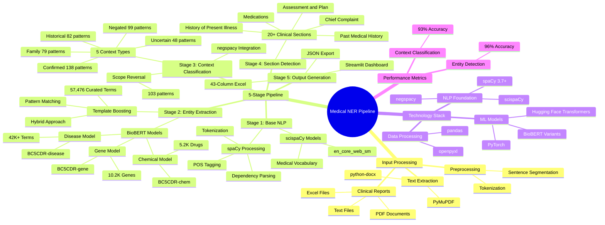

# Medical NER Pipeline - Architecture Overview

```mermaid
mindmap
  root((Medical NER Pipeline))
    Input Processing
      Clinical Reports
        PDF Documents
        Text Files
        Excel Files
      Text Extraction
        PyMuPDF
        python-docx
      Preprocessing
        Sentence Segmentation
        Tokenization
    5-Stage Pipeline
      Stage 1: Base NLP
        spaCy Processing
          Tokenization
          POS Tagging
          Dependency Parsing
        scispaCy Models
          en_core_web_sm
          Medical Vocabulary
      Stage 2: Entity Extraction
        BioBERT Models
          Disease Model
            BC5CDR-disease
            42K+ Terms
          Chemical Model
            BC5CDR-chem
            5.2K Drugs
          Gene Model
            BC5CDR-gene
            10.2K Genes
        Template Boosting
          57,476 Curated Terms
          Pattern Matching
          Hybrid Approach
      Stage 3: Context Classification
        5 Context Types
          Confirmed 138 patterns
          Negated 99 patterns
          Uncertain 48 patterns
          Historical 82 patterns
          Family 79 patterns
        negspacy Integration
        Scope Reversal
          103 patterns
      Stage 4: Section Detection
        20+ Clinical Sections
          Chief Complaint
          History of Present Illness
          Past Medical History
          Medications
          Assessment and Plan
      Stage 5: Output Generation
        43-Column Excel
        Streamlit Dashboard
        JSON Export
    Technology Stack
      NLP Foundation
        spaCy 3.7+
        scispaCy
        negspacy
      ML Models
        Hugging Face Transformers
        PyTorch
        BioBERT Variants
      Data Processing
        pandas
        openpyxl
    Performance Metrics
      Entity Detection
        96% Accuracy
      Context Classification
        93% Accuracy
```
