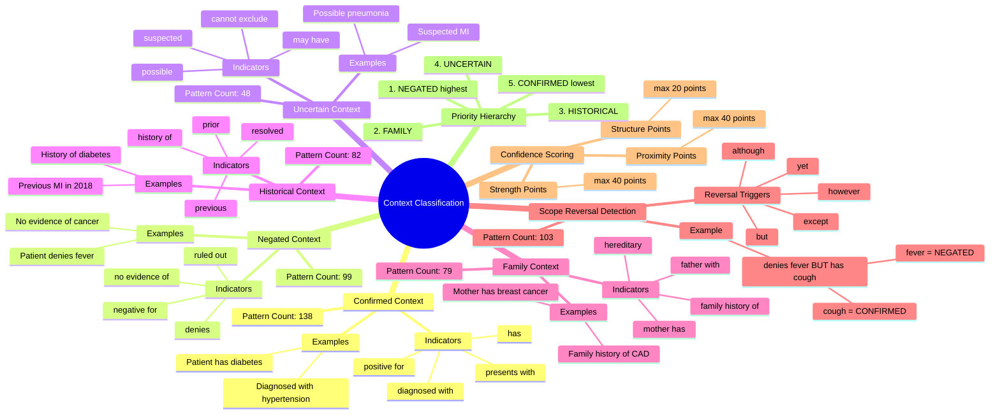

# Medical NER Pipeline - Context Classification

```mermaid
mindmap
  root((Context Classification))
    Confirmed Context
      Pattern Count: 138
      Indicators
        diagnosed with
        has
        presents with
        positive for
      Examples
        Patient has diabetes
        Diagnosed with hypertension
    Negated Context
      Pattern Count: 99
      Indicators
        denies
        no evidence of
        negative for
        ruled out
      Examples
        No evidence of cancer
        Patient denies fever
    Uncertain Context
      Pattern Count: 48
      Indicators
        possible
        suspected
        cannot exclude
        may have
      Examples
        Possible pneumonia
        Suspected MI
    Historical Context
      Pattern Count: 82
      Indicators
        history of
        previous
        resolved
        prior
      Examples
        History of diabetes
        Previous MI in 2018
    Family Context
      Pattern Count: 79
      Indicators
        family history of
        mother has
        father with
        hereditary
      Examples
        Mother has breast cancer
        Family history of CAD
    Scope Reversal Detection
      Pattern Count: 103
      Reversal Triggers
        but
        however
        yet
        although
        except
      Example
        denies fever BUT has cough
          fever = NEGATED
          cough = CONFIRMED
    Confidence Scoring
      Strength Points
        max 40 points
      Proximity Points
        max 40 points
      Structure Points
        max 20 points
    Priority Hierarchy
      1. NEGATED highest
      2. FAMILY
      3. HISTORICAL
      4. UNCERTAIN
      5. CONFIRMED lowest
```
