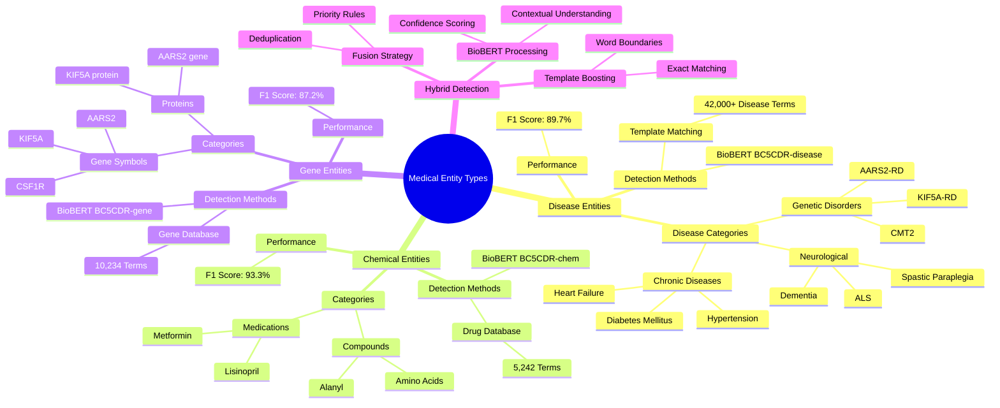

# Medical NER Pipeline - Entity Types

```mermaid
mindmap
  root((Medical Entity Types))
    Disease Entities
      Detection Methods
        BioBERT BC5CDR-disease
        Template Matching
          42,000+ Disease Terms
      Disease Categories
        Chronic Diseases
          Diabetes Mellitus
          Hypertension
          Heart Failure
        Neurological
          Spastic Paraplegia
          ALS
          Dementia
        Genetic Disorders
          KIF5A-RD
          AARS2-RD
          CMT2
      Performance
        F1 Score: 89.7%
    Chemical Entities
      Detection Methods
        BioBERT BC5CDR-chem
        Drug Database
          5,242 Terms
      Categories
        Medications
          Metformin
          Lisinopril
        Compounds
          Alanyl
          Amino Acids
      Performance
        F1 Score: 93.3%
    Gene Entities
      Detection Methods
        BioBERT BC5CDR-gene
        Gene Database
          10,234 Terms
      Categories
        Gene Symbols
          KIF5A
          AARS2
          CSF1R
        Proteins
          KIF5A protein
          AARS2 gene
      Performance
        F1 Score: 87.2%
    Hybrid Detection
      BioBERT Processing
        Contextual Understanding
        Confidence Scoring
      Template Boosting
        Exact Matching
        Word Boundaries
      Fusion Strategy
        Deduplication
        Priority Rules
```
