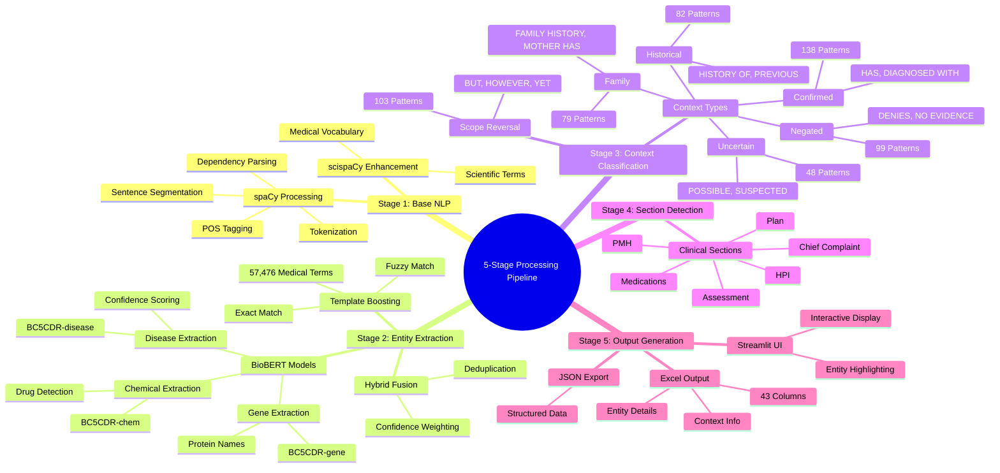

# Medical NER Pipeline - Processing Pipeline Flow

```mermaid
mindmap
  root((5-Stage Processing Pipeline))
    Stage 1: Base NLP
      spaCy Processing
        Tokenization
        Sentence Segmentation
        POS Tagging
        Dependency Parsing
      scispaCy Enhancement
        Medical Vocabulary
        Scientific Terms
    Stage 2: Entity Extraction
      BioBERT Models
        Disease Extraction
          BC5CDR-disease
          Confidence Scoring
        Chemical Extraction
          BC5CDR-chem
          Drug Detection
        Gene Extraction
          BC5CDR-gene
          Protein Names
      Template Boosting
        57,476 Medical Terms
        Exact Match
        Fuzzy Match
      Hybrid Fusion
        Confidence Weighting
        Deduplication
    Stage 3: Context Classification
      Context Types
        Confirmed
          138 Patterns
          HAS, DIAGNOSED WITH
        Negated
          99 Patterns
          DENIES, NO EVIDENCE
        Uncertain
          48 Patterns
          POSSIBLE, SUSPECTED
        Historical
          82 Patterns
          HISTORY OF, PREVIOUS
        Family
          79 Patterns
          FAMILY HISTORY, MOTHER HAS
      Scope Reversal
        103 Patterns
        BUT, HOWEVER, YET
    Stage 4: Section Detection
      Clinical Sections
        Chief Complaint
        HPI
        PMH
        Medications
        Assessment
        Plan
    Stage 5: Output Generation
      Excel Output
        43 Columns
        Entity Details
        Context Info
      Streamlit UI
        Interactive Display
        Entity Highlighting
      JSON Export
        Structured Data
```
