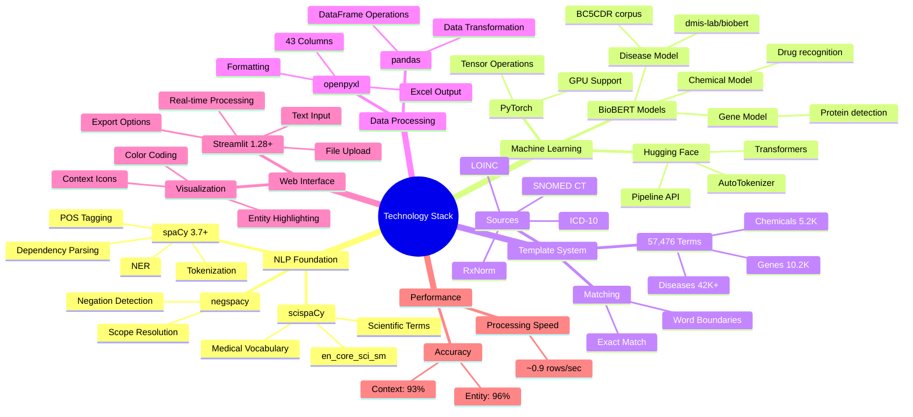

# Medical NER Pipeline - Technology Stack

```mermaid
mindmap
  root((Technology Stack))
    NLP Foundation
      spaCy 3.7+
        Tokenization
        POS Tagging
        Dependency Parsing
        NER
      scispaCy
        en_core_sci_sm
        Medical Vocabulary
        Scientific Terms
      negspacy
        Negation Detection
        Scope Resolution
    Machine Learning
      BioBERT Models
        Disease Model
          dmis-lab/biobert
          BC5CDR corpus
        Chemical Model
          Drug recognition
        Gene Model
          Protein detection
      Hugging Face
        Transformers
        AutoTokenizer
        Pipeline API
      PyTorch
        GPU Support
        Tensor Operations
    Template System
      57,476 Terms
        Diseases 42K+
        Chemicals 5.2K
        Genes 10.2K
      Sources
        ICD-10
        SNOMED CT
        RxNorm
        LOINC
      Matching
        Exact Match
        Word Boundaries
    Data Processing
      pandas
        DataFrame Operations
        Data Transformation
      openpyxl
        Excel Output
        43 Columns
        Formatting
    Web Interface
      Streamlit 1.28+
        File Upload
        Text Input
        Real-time Processing
        Export Options
      Visualization
        Entity Highlighting
        Context Icons
        Color Coding
    Performance
      Processing Speed
        ~0.9 rows/sec
      Accuracy
        Entity: 96%
        Context: 93%
```
